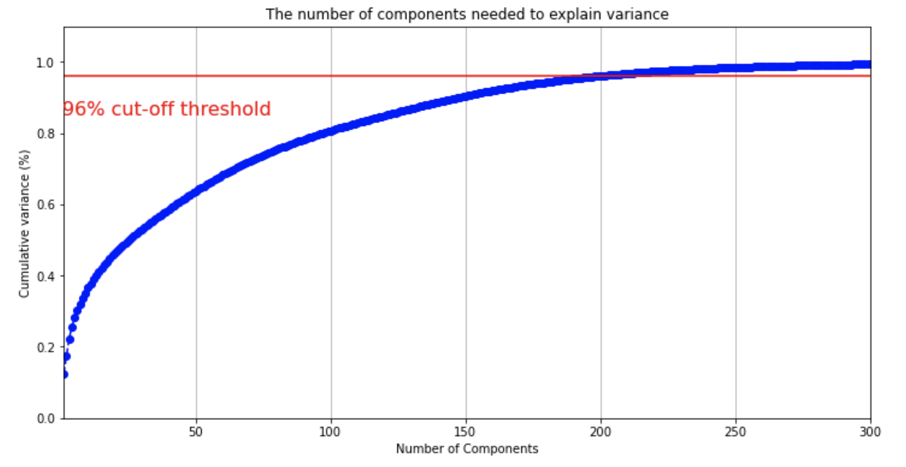

# Amex_Defaut_Prediction
#### Kaggle Competition: https://www.kaggle.com/competitions/amex-default-prediction
#### AMEX-Feather-Dataset: https://www.kaggle.com/datasets/munumbutt/amexfeather

## Default Prediction: Final Writeup

Hoi Ching Cheung, Jinzhao Kang, Ruize Hou

Credit cards has become one of the most popular payment methods whether people are buying a cup of coffee or buying a new technological product. It is important for card issuers to be able to predict whether card users will pay back or not. Hence, credit default prediction is central for risk management in payment companies such as American Express. Better predictions lead to optimized decisions which can improve customer experience and companies' financial decisions. Our team would like to apply the knowledge we learned from this course to improve current credit default prediction.

## Method
In this project, we used four machine learning models: logistic regression, random forest, gradient boosting, and neural network using MLP. Prior to training, we preprocessed and conducted feature engineering on the dataset. Common algorithms that are used to make default predictions are classification algorithms, including Random Forest, Logistic Regression, XGBoost, etc. We want to apply these methods in our prediction and further try using a more complicated method, MLP in neural network, to pursue a better default prediction. Furthermore, we apply PCA to substitute traditional feature selection methods due to the special anonymized characteristic of this dataset.

### Data Preprocessing
Our project uses the AMEX-default-prediction dataset on Kaggle. The dataset consists of 16.39 GB of training data and 33.82 GB of testing data which is too large for the local Jupyter notebook or other resources to handle and can result in long processing time. To solve this problem, we want to replace the default pandas.read\_csv function, which loads data in the ‘double’ format, by reading the data into float32/int8/int16 format to reduce the data size. We use an alternative dataset, AMEX-Feather-Dataset, in which the floating-point precision has been reduced from 64-bit to 16-bit, hence reduced the original training data from 33.82 GB to 1.73 GB. The feather dataset allows us to process more efficiently.

There are in total of 190 features in the dataset and 121 of them had missing values. First, we decided to drop features that have larger than 1\% (of 5531451 samples) missing values, which left us 115 features. With the remained features that have missing values, for numerical values, all missing values were replaced by the mean of their corresponding features. And for categorical values, all missing values were replaced by a newly defined dummy category "Unknown". The number of dummy variables is reasonable (around 5 at maximum for each categorical feature). At this point, there's no NaN value in the training or testing dataset. We also dropped two features that are neither numerical nor categorical (for example, dates). After we remove all NaN values in the dataset, we performed one-hot-encoding for the categorical features. In addition, features that do not appear in both the training and testing dataset is removed. We also removed customers that have less than 13 rows which reduces the number of rows of the training dataset from 5,531,451 to 5,018,442.

### Feature Engineering
The data set consists of five types of variables. Delinquency variables, spend variables, payment variables, balance variables, and risk variables associated with a customer ID to distinguish from each observation. The data set has 5531451 observations, but the number of unique customer IDs is only 458913, so there are multiple observations for one single customer. By grouping by customer ID and our target variable (whether the customer default), we find that the number of observations is still 458913, which shows that one customer is only labeled with one target value. Based on this fact, we decided to aggregate all the observations of each customer by mean, max, and min statistics because we believe that the overall performance of a customer will give us a better prediction of the default behavior. The target variable is unbalanced, with a default proportion of 0.249. We will use a different metric to evaluate our model to adjust for the unbalanced data, which will be discussed later. Given the fact that all the features are anonymized, it is not a major task to build an interpretable model. After trying several feature selection methods, including forward and backward selection, regularization, and PCA, PCA gave us the best prediction based on our metric. Before using PCA, we standardize all the numerical variables to the scale of (0,1). Our goal is to reach an explained variance of $95\%$ to $99\%$ without selecting too many principle components to achieve a well-represented data set while avoiding overfitting. We set the threshold at $96\%$, and we choose 200 principle components to reach this threshold based on the graph below.

### Model

#### Logistic Regression
Logistic regression is a form of supervised machine learning that is used to calculate or predict a binary outcome. It estimates the probability of occurrence of a characteristic, in our case, the probability that a customer default. The logistic model is based on the logistic function, which only allows values between 0 and 1.

Logistic regression is a classification algorithm which uses a model 
$f_\theta$ of the form $\[f_\theta(x)=\sigma(\theta^Tx)=\frac{1}{1+exp(-\theta^Tx)}\]$
where
$\[\sigma(z)=\frac{1}{1+exp(-z)}\]$
is the sigmoid or logistic function.

#### Random Forests
Random forests are a supervised learning method for both regression and classification, its model family is bagged decision trees. Random forests solve two problems of decision trees which are: firstly, the decision boundary between the two classes is non-smooth; secondly, the decision tree overfits the data when the trees have high depth.

#### Gradient Boosting
Gradient boosting is a supervised learning method that is used in regression and classification. It reduces underfitting by combining models that correct each other's errors, and each predictor corrects its predecessor's errors.

#### MLP Neural Network
A multilayer perceptron(MLP) is a fully connected neutral network which can be used for both regression and classification as a supervised learning method. An MLP consists of three layers: one input layer, one output layer, and one hidden layer. Neural networks are trained using gradient descent, and we use backpropagation to compute gradient efficiently. Backpropagation computes gradient in two steps. In the first step, it starts with the input $x$ and computes the ouput $y_l$ of each layer $f_l$, this is called the forward pass. In the second step, we start from the top and recursively compute the following partial derivatives:
$\[\frac{\partial J}{\partial y_lk} \quad \frac{\partial J}{\partial w_lkj}\]$
where $y_lk$ is the output of the $k$-th neuron in layer $l$, and $\partial w_lkj$ is the $kj$-th weight in layer $l$, this is called the backward pass.

## Experiment
### Metric
Since our dataset is imbalanced, using a naive accuracy score to define model performances would not be accurate -- a model can get a high accuracy score by predicting the more frequent class all the time. Therefore, we decided to use balanced accuracy as our metrics to reveal both true positive and true negative rates.
$$balanced\ accuracy = \frac{1}{2}(\frac{TN}{TN+FP} + \frac{TP}{TP+FN })$$
\subsection{Hyper-parameter tuning}
For tree-based models, hyper-parameters $max\_depth$ and $n\_estimator$ are tuned whenever possible. We find that changing $n\_estimator$ does not make a significant impact on the models. We also find that the models usually have the best performance that does not overfit when having a shallower $max\_depth$. Specifically, Random Forest achieves its optimal performance at $max\_depth=10$ and Adaboost achieves it at $max\_depth=6$

\begin{figure}[!ht]
\minipage{0.5\textwidth}
  \includegraphics[width=\linewidth]{images/random_forest_depth.png}
  \caption{Random Forest tuning max\_depth}\label{fig:random_forest_depth}
\endminipage\hfill
\minipage{0.5\textwidth}
  \includegraphics[width=\linewidth]{images/random_forest_estimators.png}
  \caption{Random Forest tuning n\_estimators}\label{fig:random_forest_estimators}
\endminipage
\end{figure}

\begin{figure}[!ht]
\minipage{0.5\textwidth}
  \includegraphics[width=\linewidth]{images/gradient_depth.png}
  \caption{Gradient Boosting tuning max\_depth}\label{fig:gradient_boosting_depth}
\endminipage\hfill
\minipage{0.5\textwidth}
  \includegraphics[width=\linewidth]{images/gradient_estimators.png}
  \caption{Gradient Boosting tuning n\_estimators}\label{fig:gradient_boosting_estimators}
\endminipage\hfill
\end{figure}

For the MLP neural network, since there are many hyper-parameters involved, $GridSearchCV$ is preferred to select the optimal combination. We defined the parameter space for grid searching as follows:
\begin{itemize}
  \item $hidden\_layer\_sizes: [20, 60, 80, 100]$
  \item $activation: [tanh, relu, logistic]$
  \item $solver: [sgd, adam]$
  \item $alpha: [0.0001, 0.01, 0.05, 0.1]$
  \item $learning\_rate: [constant, adaptive]$
\end{itemize}
And the optimal parameter combination is $hidden\_layer\_sizes=80$, $activation=logistic$, $solver=adam$, $alpha=0.1$, $learning\_rate=adaptive$ with the best score being 0.868.

\subsection{Result}
Lastly, each model is trained with the optimal hyper-parameters obtained from the last stage. Again, the metric is balanced accuracy due to the imbalance of our dataset. For the validations, 3-fold cross-validation is used and the mean value is reported as the final validation score. The results are listed in Table \ref{table:1}.

\begin{table}[h!]
\centering
\begin{tabular}{ |c|c|c| } 
 \hline
 Model                            & Train Acc &  Val Acc\\
 \hline
 Logistic Regression              &   0.858   &  0.857\\
 Random Forest (max\_depth=10)    &   0.824   &  0.817\\
 Gradient Boosting (max\_depth=6) &   0.846   &  0.837\\
 MLP Neural Network               &   0.875   &  0.868\\
 \hline
\end{tabular}
\caption{Train and validation accuracy for each model.}
\label{table:1}
\end{table}

\section{Conclusion}
In conclusion, our feature engineering and model selection significantly increased the prediction accuracy of the default. By using PCA for feature engineering with logistic regression, we have a validation accuracy of 0.857, which is better than the validation accuracy of 0.822 of the baseline model (Logistic Regression with Forward Selection). The usage of PCA in choosing the proper number of PCs prevented our model from overfitting and underfitting, hence giving us better validation accuracy. The MLP neural network method gave us the best model. We showed the effectiveness of using neural network on a large-scale dataset. However, it requires more computational time compared to tree-based algorithms and regressions, and the cost should be considered when applying algorithms in industries.
\end{document}
